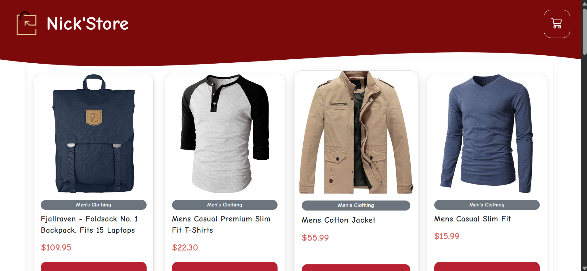
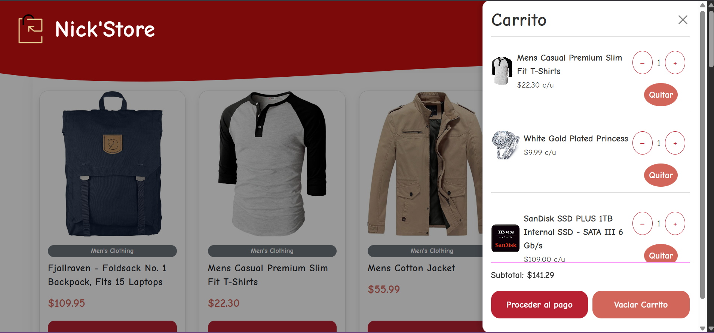
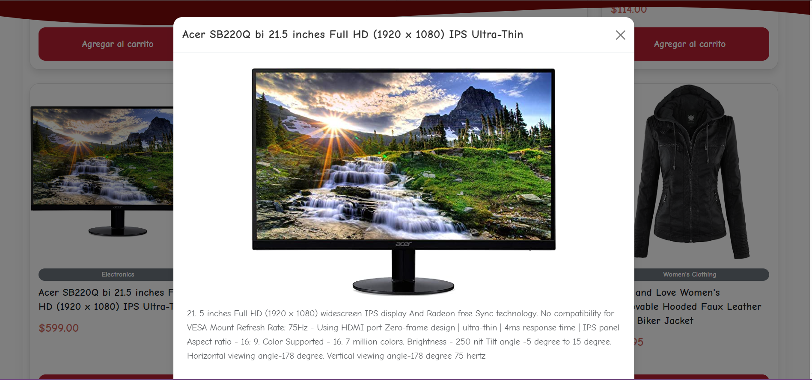

# Tienda Virtual TTN - Prueba Técnica

---

##  Proyecto

Desarrollo de una tienda virtual simple como parte de la prueba técnica de frontend para TTN. Se implementa sin frameworks de JavaScript, utilizando HTML, CSS y JavaScript puro.


##  Contenidos

- [Vista previa](#-vista-previa)
- [Estructura del proyecto](#-estructura-del-proyecto)
- [Tecnologías utilizadas](#-tecnologías-utilizadas)
- [Explicación general del funcionamiento](#-explicación-general-del-funcionamiento)
- [Instrucciones para correr el proyecto](#-instrucciones-para-correr-el-proyecto)
- [Notas adicionales](#-notas-adicionales)

---

##  Vista previa








##  Estructura del proyecto

```
/
|-- index.html
|-- styles.css
|-- script.js
|-- /img
    |-- inicio.png
    |-- carrito.png
    |-- descripcion.png
    |-- logo.png
    |-- favicon.png
```


##  Tecnologías utilizadas

- HTML5
- CSS3
- JavaScript (Vanila)
- Bootstrap 5 


##  Explicación general del funcionamiento

### Estructura

- **index.html**: define el esqueleto de la tienda, incluyendo:
  - Barra de navegación.
  - Listado de productos.
  - Carrito de compras.
  - Modal para ver detalles de producto.

- **styles.css**: contiene estilos personalizados para:
  - Tarjetas de producto.
  - Animaciones de botones.
  - Estilos del carrito.

- **script.js**: gestiona toda la lógica:
  - Obtención y renderizado de productos.
  - Manejo de eventos (agregar al carrito, ver descripción, eliminar productos, vaciar carrito).
  - Cálculo automático del subtotal.


### Flujo de carga de productos

1. Se hace una petición a `https://fakestoreapi.com/products` usando `fetch`.
2. Se obtienen los productos en formato JSON.
3. Cada producto se representa como una tarjeta (`card`) con:
   - Imagen.
   - Categoría.
   - Título.
   - Precio.
   - Botón "Agregar al carrito".

Ejemplo de carga:

```javascript
fetch('https://fakestoreapi.com/products')
  .then(res => res.json())
  .then(data => {
    data.forEach(product => renderProduct(product));
  });
```


### Manejo del carrito

- Los productos seleccionados se almacenan en un array `cart`.
- Si se agrega un producto que ya existe en el carrito, solo se incrementa su cantidad.
- Al modificar cantidades o eliminar productos, el subtotal se recalcula inmediatamente.

Ejemplo de agregar al carrito:

```javascript
function addToCart(product) {
  const found = cart.find(item => item.id === product.id);
  if (found) {
    found.quantity++;
  } else {
    cart.push({ ...product, quantity: 1 });
  }
  updateCartUI();
}
```


### Eventos principales

- **Agregar al carrito**: detectado en el botón dentro de cada tarjeta de producto.
- **Ver descripción**: al hacer click en la imagen, se muestra un modal con detalles.
- **Vaciar carrito**: elimina todos los productos y reinicia subtotal.
- **Eliminar producto**: elimina solo el ítem seleccionado del carrito.


##  Instrucciones para correr el proyecto

1. Clonar o descargar el repositorio.
2. Colocar las imágenes (`inicio.png`, `carrito.png`, `descripcion.png`) en la carpeta `/img`.
3. Abrir `index.html` directamente en el navegador.
4. Asegurarse de tener acceso a internet para cargar Bootstrap y la API de productos.


##  Notas adicionales

- No se utilizó React, Vue, ni ningún framework.
- El código está comentado para facilitar su comprensión.
- Se podría mejorar usando almacenamiento local (`localStorage`) para persistir el carrito.
- El diseño es responsivo y compatible con dispositivos móviles.
- puede abrirse una pagina de despliegue del repositorio en este link: https://itsmar7in.github.io/prueba-TTN/

---

#  Fecha

Abril 2025.

---

#  Autor

Martín Pérez Torres
